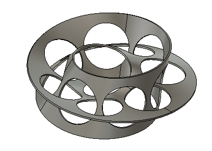
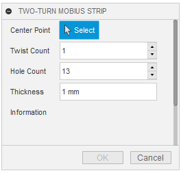
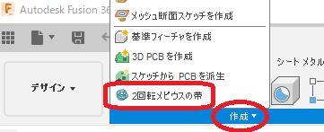
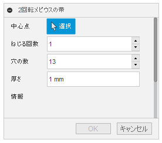

# ***Fusion360  Two-turn Möbius strip***
This is an add-in for the Autodesk software "Fusion360".

Create a two-turn Möbius strip.

***
## Installation :
To install, download/extract the zip file and register the "Two-turn_Möbius_strip" folder as an add-in.

To register an add-in,Please follow the instructions [here](https://knowledge.autodesk.com/support/fusion-360/troubleshooting/caas/sfdcarticles/sfdcarticles/How-to-install-an-ADD-IN-and-Script-in-Fusion-360.html).

## Usage :
+ Launch the add-in. The command will be added within the "Create" tab of "Solids".

    
+ Execute the command.

+ A dialog box will appear. Set each item.

    
    + Center Point : The center point of the Möbius strip to be created. Specify the sketch point.
    + Twist Count : Specify the number of times you want to twist the strip (one time is 180°) between two revolutions.
        + Due to the nature of the Möbius strip, only odd numbers are available.
        + The limit is in the range of 1~29 times.
    + Hole Count : 2Specify the number of holes to avoid interference when rotating.
        + For the convenience of creating an even arrangement of holes, only odd numbers are available.
        + It is limited to 13~49 pieces. 
        + Depending on the number of holes, the overall size will be changed.
    + Thickness : Enter the thickness dimensions of the Möbius strip.
        + Excessive thickness may result in an error.
    + Information : If the set value is not correct, the reason for the cause is displayed.

+ By pressing the OK button, a two-turn Möbius strip will be created in the new component.

## Constraints：
- Due to the complexity of the shape, it will take some time to create.
- The preview is shown without the hole in order to show it in a short time.

## Issue：
- without

## Action :
Confirmed in the following environment.
 + Fusion360 Ver2.0.9719
 + Windows10 64bit Pro , Home

## License :
MIT

## Acknowledgments :
+ Thank you everyone in the [Japanese forum.](https://forums.autodesk.com/t5/fusion-360-ri-ben-yu/bd-p/707)

***
***
以下、日本語です。

これは、オートデスクソフトウェア「Fusion360」のアドインです。

2回転のメビウスの帯を作成します。

***
## インストール :
インストールする際は、zipファイルをダウンロード/展開後 "Two-turn_Möbius_strip" フォルダをアドインとして登録してください。

アドインの登録は、[こちら](https://knowledge.autodesk.com/ja/support/fusion-360/troubleshooting/caas/sfdcarticles/sfdcarticles/JPN/How-to-install-an-ADD-IN-and-Script-in-Fusion-360.html)の手順に従ってください。

## 使用法 :
+ アドインを起動。"ソリッド" の "作成" タブ内にコマンドが追加されます。

    
+ コマンドを実行。

+ ダイアログが表示されます。各項目を設定して下さい。

    
    + 中心点 : 作成するメビウスの帯の中心点。スケッチ点を指定してください。
    + ねじり回数 : 2回転する間に帯をねじる回数(1回は180°)を指定してください。
        + メビウスの帯の性質上、奇数のみです。
        + 1~29回の範囲で制限しています。
    + 穴の数 : 2回転する際、干渉を回避するための穴の数を指定してください。
        + 均等な穴の配置を作成する都合上、奇数のみです。
        + 13~49個の範囲で制限しています。 
        + 穴の数により、全体の大きさが変更されます。
    + 厚さ : メビウスの帯の厚さ寸法を入力してください。
        + 過剰な厚みにするとエラーとなる可能性が有ります。
    + 情報 : 設定値が正しくない場合に、原因となる理由を表示します。

+ OKボタンを押すことで、新たなコンポーネントに2回転メビウスの帯が作成されます。

## 制約 ：
- 形状が複雑な為、作成時に程々の時間がかかります。
- プレビューは短時間で表示させるために、穴の開いていない状態を表示させています。

## 問題 ：
- 無し

## アクション :
以下の環境で確認しています。
 + Fusion360 Ver2.0.9719
 + Windows10 64bit Pro , Home

## ライセンス :
MIT

## 謝辞 :
+ [日本語フォーラム](https://forums.autodesk.com/t5/fusion-360-ri-ben-yu/bd-p/707)の皆さん、ありがとう。
+ 上記の英語で不適切な部分をして頂けると助かります。